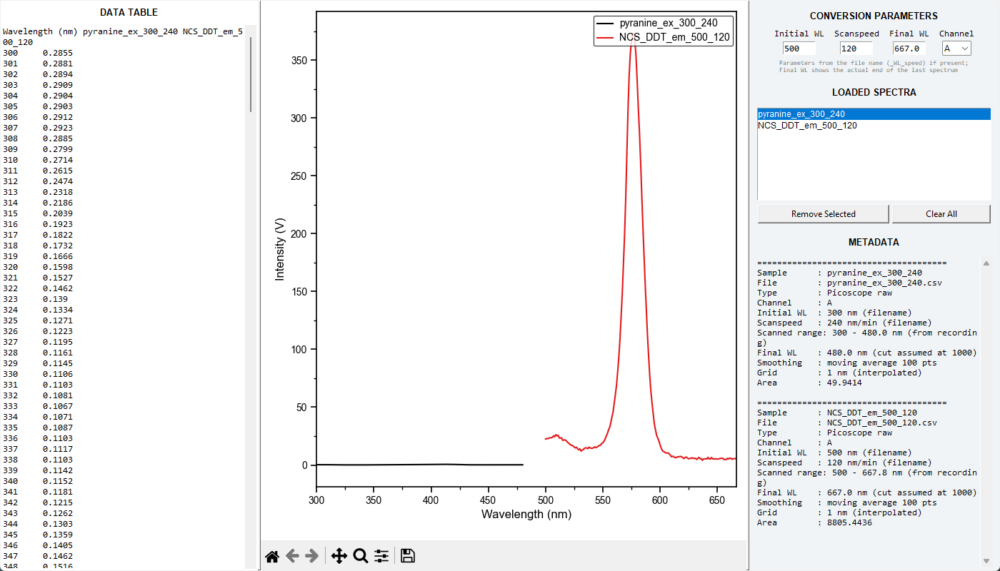

# Picoscope

A small desktop app (tkinter + matplotlib) that turns raw Picoscope recordings of a
wavelength-scanning measurement into spectra: time is converted to wavelength, the signal is
smoothed and resampled on a 1 nm grid, and several spectra can be compared and exported
together. Its look and workflow follow
[LabSpectrumManager](https://github.com/milanone/LabSpectrumManager), and its plots use the shared Origin-like
style of [PlotStyleKit](https://github.com/milanone/PlotStyleKit).



## What it does

- Reads CSV exported from the Picoscope software (two header lines, then `Time`,
  `Channel A` and optionally `Channel B`) and also loads spectra that are already converted
  (two numeric columns, wavelength and intensity, no header).
- Converts time to wavelength: `wavelength = initial WL + t × scan speed / 60`, with the
  scan speed in nm/min. Only points with `t > 0` are kept.
- Smooths the signal with a centred moving average (100 points, equivalent to MATLAB's
  `smooth(x,100)`) and interpolates it on integer wavelengths at 1 nm steps.
- Loads many spectra at once: data table, plot with a cursor showing the values under the
  mouse, list of loaded spectra with their metadata (including the integrated area).
- Right-click a spectrum in the list to copy it to the clipboard as X/Y columns, or in a layout for pasting into Origin.
- Exports all loaded spectra to a single CSV (one column per spectrum, wavelength as index).
- `File` menu: `Save Figure Image (PNG, PDF, SVG)...`, `Save Figure (pickle)...` and `Edit Figure...` (opens the
  PlotStyleKit figure editor on a copy of the plot, restyled as a 4:3 single-column Origin figure).

## Conversion parameters

The initial wavelength and the scan speed are read from the **end of the file name**:

```
<sample>_<initial WL>_<scan speed>.csv      e.g.  pyranine_ex_300_240.csv
```

means a scan starting at 300 nm at 240 nm/min. If the name does not end like that, the app
uses the values typed in the *Initial WL* and *Scanspeed* fields of the right-hand panel.
The channel to convert (A or B) is chosen in the same panel.

The final wavelength is assumed to be 1000 nm and the *Final WL* field is then updated to
the actual end of the recorded scan.

## Run

```
pip install -r requirements.txt
python picoscope_gui.pyw
```

`pythonw picoscope_gui.pyw [file.csv ...]` starts it without a console window. Files can be
opened from the dialog, passed on the command line or dropped on the window when `tkinterdnd2` is installed.
The plot style needs the [PlotStyleKit](https://github.com/milanone/PlotStyleKit) repo next to this folder; without
it the app still works with plain matplotlib defaults and the figure editor is unavailable.

## Tests

```
py -m unittest discover -s tests -v
```

The conversion and the app are tested on synthetic recordings; one test also loads a real recording from
`example data/` if it is there (gitignored).

## Data

This repository contains code only: `.gitignore` excludes `*.csv` and the `example data/` folder, so recordings
and converted spectra stay on your machine. The screenshot shows two real recordings.

## Requirements

Python 3.10+, numpy 2.0 or newer (the area uses `np.trapezoid`), pandas, matplotlib, and
optionally `tkinterdnd2`. Tested on Windows only.

## License

[MIT](LICENSE)
